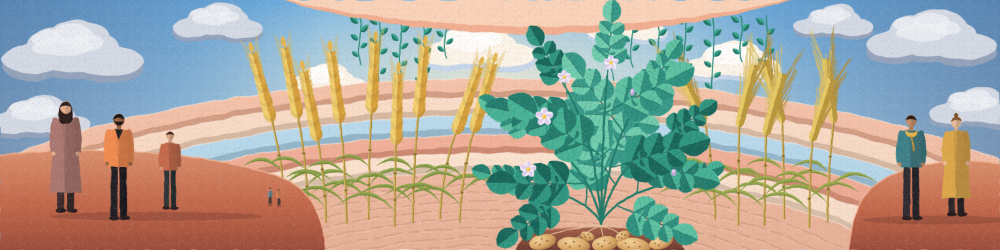

# Agricultural Market Resilience in Germany

*A Comparative Analysis of Wheat, Barley and Potato Markets*

# Project Overview

**Problem.**  Agricultural markets are exposed to external shocks that can disrupt supply chains, increase price volatility, and affect domestic production and trade. However, the effects of these shocks may differ across agricultural commodities, as markets vary in their vulnerability and capacity to adjust to changing conditions. Comparing wheat, barley, and potato markets in Germany can provide insights into these differences and their implications for market resilience.

**Goal.**  Analyze the economic mechanisms of selected agricultural commodities across three dimensions and throughout the pre-crisis, crisis, and post-crisis phases to answer the following research questions.

1. Availability and Supply Balance. How do domestic production, imports, exports, stocks, and domestic use change?
2. Price Stability. How do the three agricultural markets differ in their vulnerability to external shocks and their capacity to adapt?
3. Adjustment and Recovery. How do supply balances and prices evolve during and after crises, and how quickly do they return toward pre-crisis conditions?

**Approach.**  Data collection and preparation, exploratory analysis, and visualisation of market and price dynamics, as well as international trade dependencies, to investigate shock magnitude, response timing, shock duration, and recovery patterns.

## Crisis and Shock Overview

<h3></h3>

| Period         | Event / Shock                                           | Main Transmission Channels                  |
| -------------- | ------------------------------------------------------- | ------------------------------------------- |
| 2002–2003      | Drought and heat in Europe                              | Crop yields and agricultural supply         |
| 2007–2008      | Global food price crisis                                | Commodity prices and market volatility      |
| 2010–2011      | Russian drought and grain export restrictions           | Grain availability and international prices |
| 2018–2019      | Drought and heat in Europe                              | Crop yields and production                  |
| 2020–2022      | COVID-19 pandemic                                       | Labour, logistics and demand                |
| 2021–2023      | Energy and fertiliser price shocks                      | Production and input costs                  |
| From 2022      | Russian invasion of Ukraine                             | Grain trade, energy and fertiliser markets  |
| 2022–2024      | Inflation and food price pressures                      | Production costs and price transmission     |
| From late 2023 | Red Sea shipping disruptions                            | Freight costs and delivery times            |
| 2025           | German harvest and agricultural market developments     | Production, supply and producer prices      |
| From 2026      | Iran and wider Middle East conflict                     | Energy, fertiliser and shipping costs       |
| 2026           | Weather-related risks to German agricultural production | Crop yields and domestic supply             |

*Note: This preliminary overview identifies selected shocks and potential transmission channels. Their effects on German wheat, barley and potato markets will be examined empirically.*

**Selected institutional references:** [OECD – Agricultural Risk and Resilience](https://doi.org/10.1787/2250453e-en) · [FAO – Agricultural Commodity Markets](https://www.fao.org/publications/fao-flagship-publications/the-state-of-agricultural-commodity-markets/) · [European Commission – Fertiliser Markets](https://agriculture.ec.europa.eu/common-agricultural-policy/agri-food-supply-chain/ensuring-availability-and-affordability-fertilisers_en) · [Destatis – Agriculture Statistics](https://www.destatis.de/EN/Themes/Economic-Sectors-Enterprises/Agriculture-Forestry-Fisheries/_node.html)

## Progress

* 🟢 Project Concept
* 🟡 Data Collection
* 🟡 Data Exploration
* ⚪ Data Cleaning and Preparation
* ⚪ Data Analysis
* ⚪ Data Visualisation
* ⚪ Final Report and Insights

# Author

Kordula Pfeiffer. Agricultural and Food Economist. [LinkedIn.](https://www.linkedin.com/in/kordulapfeiffer/)

